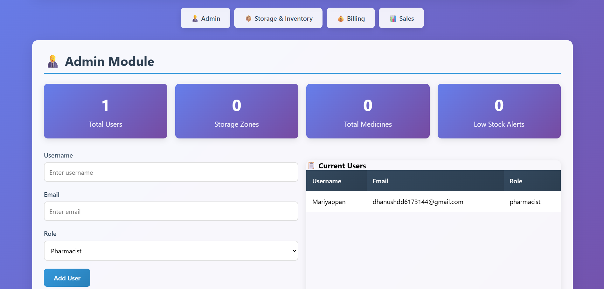
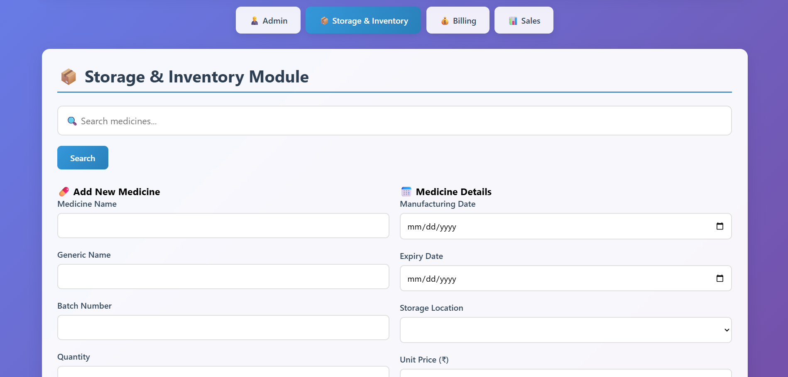
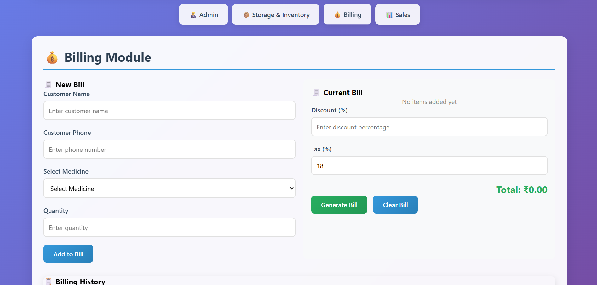
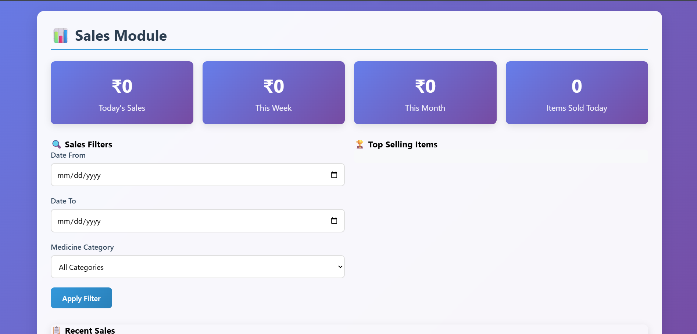

💊 Medical Shop Inventory Management System

The Medical Shop Inventory Management System is a Flask-based web application designed to help pharmacies and medical shops manage their inventory, sales, and billing efficiently. It automates stock tracking, billing, and sales reports, reducing manual errors and improving business operations.

✨ Features

📦 Inventory Management – Add, update, and manage medicines with batch, expiry, price, and quantity.

🧾 Billing System – Generate quick and accurate bills with multiple medicines in a single transaction.

📊 Sales Reports – Track daily, weekly, and monthly sales with top-selling medicines.

⏰ Stock & Expiry Alerts – Get notified when medicines are low in stock or near expiry.

👩‍💼 User Roles – Admin and staff login with secure access.

🛠️ Tech Stack

- Frontend: HTML, CSS, JavaScript

- Backend: Python (Flask)

- Database: SQLite

- Tools: Git, GitHub

🚀 How to Run Locally

- Clone the repository:

git clone https://github.com/Mariyappanmm/Medical-Shop-Inventory-Management.git
cd Medical-Shop-Inventory-Management

- Create a virtual environment and activate it:

python -m venv venv
venv\Scripts\activate   # On Windows
source venv/bin/activate  # On Linux/Mac

- Install dependencies:

pip install -r requirements.txt

- Run the application:

python main.py

- Open in browser:

http://127.0.0.1:5000
## 📷 Screenshots  

### 🏠 Home Page  
  

### 💊 Medicines Management  
  

### 🧾 Billing System  
  

### 📊 Sales Dashboard  
  
